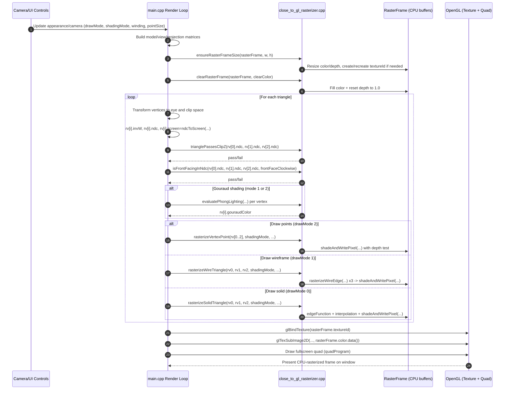

# Close2GL CPU Mode Sequence Diagram

This diagram focuses on the frame path when `appearance.close2GlMode == true`.

## Notes

- `main.cpp` orchestrates the frame and prepares per-vertex inputs.
- `close_to_gl_rasterizer.cpp` handles culling helpers, interpolation, shading, and per-pixel depth/color writes.
- Final presentation is still done through OpenGL by uploading the CPU color buffer to a texture and drawing a fullscreen quad.

